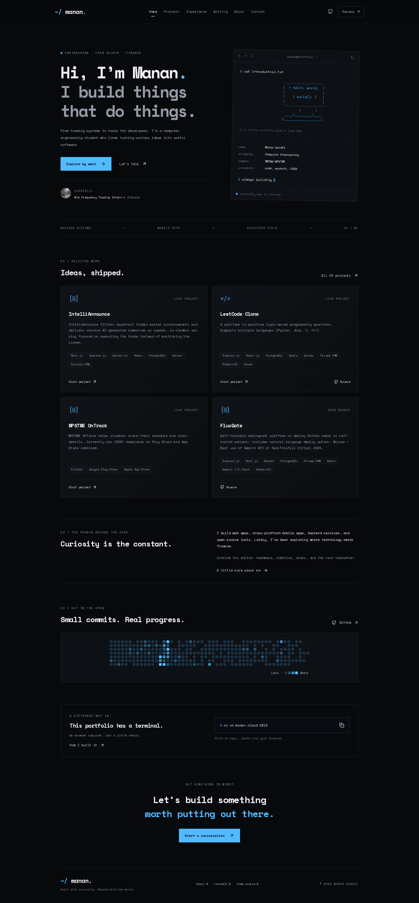

# Portfolio Website

A modern, responsive personal portfolio website built with Next.js, showcasing projects, blog posts, and professional information.



## Features

-   **Responsive Design**: Optimized for all device sizes
-   **Dark Theme**: Terminal-inspired layout, ASCII artwork, and a blue accent
-   **Project Showcase**: Searchable project archive with technology and category filters
-   **Blog Section**: Space for sharing thoughts and technical articles
-   **About Page**: Personal introduction and social links
-   **Easter Egg**: Hidden interactive feature for fun
-   **Analytics**: Integrated Vercel Analytics and Speed Insights
-   **Performance Optimized**: Built with Next.js 16 for optimal loading speeds and Server Side Rendering (SSR)

## Tech Stack

-   **Framework**: Next.js 16.0.1
-   **Language**: TypeScript
-   **Styling**: Tailwind CSS v4
-   **UI Components**: Custom components with Lucide React icons
-   **Utilities**: clsx, class-variance-authority, tailwind-merge
-   **Linting**: ESLint with Next.js configuration
-   **Analytics**: Vercel Analytics & Speed Insights
-   **Deployment**: Vercel

## Prerequisites

-   Node.js 20.9+
-   pnpm (recommended) or npm/yarn

## Local Development

1. **Clone the repository**

    ```bash
    git clone https://github.com/MananGandhi1810/portfolio-v2.git
    cd portfolio-v2
    ```

2. **Install dependencies**

    ```bash
    pnpm install
    # or
    npm install
    ```

3. **Start the development server**

    ```bash
    pnpm dev
    # or
    npm run dev
    ```

4. **Open your browser**

    Navigate to [http://localhost:3000](http://localhost:3000) to view the website.

## Content sources

The introduction and skills are based on [Manan’s GitHub profile](https://github.com/MananGandhi1810). Project descriptions and experience retain the owner-provided repository content. LinkedIn and some project websites were unavailable during research; no new claims were inferred from them.

The contact form requires `RESEND_API_KEY` and `RESEND_FROM_EMAIL`. Without these, the website still builds and the form returns an unavailable response; visitors can email `hello@manan.cloud`. GitHub contribution activity uses an external service and falls back to a profile link if it is unavailable.
